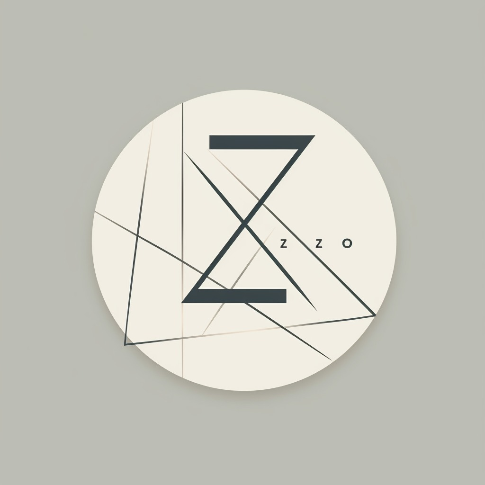

# Zero2LLM

<div align="center">
    
    <h3>从零开始学习大语言模型 | Learn LLM from Scratch</h3>
</div>


## 📚 项目简介

Zero2LLM 是一个专门面向初学者的大语言模型（LLM）学习项目。本项目采用循序渐进的方式，帮助你从最基础的 Attention 机制开始，一步步掌握现代大语言模型的核心概念和实现。

## 🎯 学习路线

我们建议按照以下顺序进行学习：

1. **基础 Attention 机制**
   - 理解 Attention 的基本原理
   - 实现简单的 Self-Attention
   - 掌握多头注意力机制
2. **NanoGPT 实现**
   - GPT 模型的基础架构
   - Transformer 解码器的实现(Decoder-only)
   - 预训练和微调过程
3. **MoE (Mixture of Experts) 模型**
   - 专家混合系统的原理
   - 动态路由机制
   - 可扩展性设计
4. **MLA (Multi Latent Attention) 模型**
   - Deepseek MLA
   - 实际应用案例
5. **Zero2LLM_all 综合实践**
   - 完整模型实现（MQA/MoE,RoPE..)
   - 性能优化
   - 实际部署经验

## 🚀 快速开始

```bash
# 克隆项目
git clone https://github.com/Delahayecarry/Zero2LLM.git

# 进入项目目录
cd Zero2LLM

# 安装依赖
pip install -r requirements.txt

# 开始学习
```

## 📂 项目结构

```
Zero2LLM/
├── Attention/        # 基础 Attention 实现
├── NanoGPT/         # NanoGPT 实现
├── moe/             # Mixture of Experts 实现
├── mla/             # Multi Latent Attention 实现
└── zero2llm_all/    # 完整项目实现（MQA/MoE,RoPE..)
    ├── model/       # 模型相关代码
    ├── tokenizer/   # tokenizer 相关文件
    ├── wandb/       # Weights & Biases 工作流和监控
    ├── datasets.py  # 数据集处理
    └── README.md    # 详细说明文档
```

## 📖 主要功能

### 1. 模型特性
- 🚀 高效的 Transformer 架构实现
- 🎯 支持 MoE (Mixture of Experts) 结构
- 💡 实现了 Flash Attention 优化
- 🔄 支持 RoPE (Rotary Position Embedding) 位置编码
- 📦 模块化设计，易于扩展

### 2. 训练功能
- 🔥 支持三种训练模式：预训练(Pretrain)、监督微调(SFT)、人类偏好对齐(DPO)
- 💾 支持梯度累积和混合精度训练
- 📊 内置 Weights & Biases 实验追踪与可视化
- 🔄 支持流式推理输出
- 🎯 支持自动化超参数优化

### 3. 工作流管理
- 🛠 完整的自动化工作流支持（setup -> sweep -> train -> evaluate -> analyze -> deploy）
- 📊 自动化超参数搜索和优化
- 📈 训练过程监控和分析
- 💾 智能检查点管理
- 📝 详细的实验记录和分析

### 4. 性能优化
- ⚡ Flash Attention 加速
- 🎯 混合精度训练
- 💡 梯度累积
- 🔄 分布式训练支持

## 🔧 使用指南

### 基础训练命令

```bash
# 预训练模式
python pretrain_sft_lora.py --mode pretrain --batch_size 32 --epochs 1

# 监督微调模式
python pretrain_sft_lora.py --mode sft --batch_size 16 --epochs 1

# 人类偏好对齐模式
python pretrain_sft_lora.py --mode dpo --batch_size 8 --epochs 2
```

### 自动化工作流

```bash
# 完整工作流（预训练模式）
python wandb/workflow.py --mode pretrain --project test_project --output_dir ./test_output --all

# 完整工作流（SFT模式）- 使用自定义数据和预训练模型
python wandb/workflow.py --mode sft --project test_project_sft --output_dir ./test_output_sft --all \
    --data_path ./dataset/sft_data.jsonl \
    --pretrained_model_path ./out/best.pt
```

### 超参数搜索

```bash
# 启动超参数搜索
python wandb/run_sweep.py --config sweep_config.yaml --count 5 --mode pretrain
```

## 📝 详细文档

每个子模块都包含详细的说明文档：
- [Attention 模块说明](Attention/README.md)
- [NanoGPT 实现说明](NanoGPT/README.md)
- [MoE 模型说明](moe/README.md)
- [MLA 模型说明](mla/README.md)
- [完整项目说明](zero2llm_all/README.md)

## 🤝 贡献指南

我们欢迎所有形式的贡献，包括但不限于：

- 提交 Bug 报告
- 改进文档
- 提供新的示例
- 优化代码实现

## 📝 许可证

本项目采用 MIT 许可证 - 详见 [LICENSE](LICENSE) 文件

## ✨ 致谢

感谢所有为本项目做出贡献的开发者和研究者。

⭐️ 如果这个项目对你有帮助，欢迎点击 Star 支持！ 

